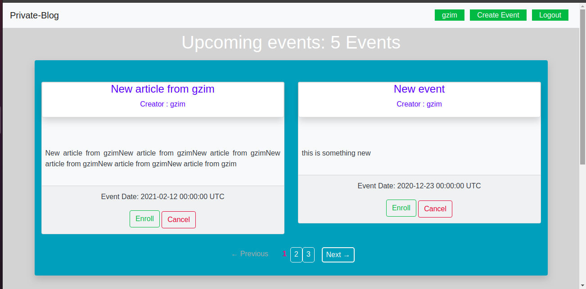
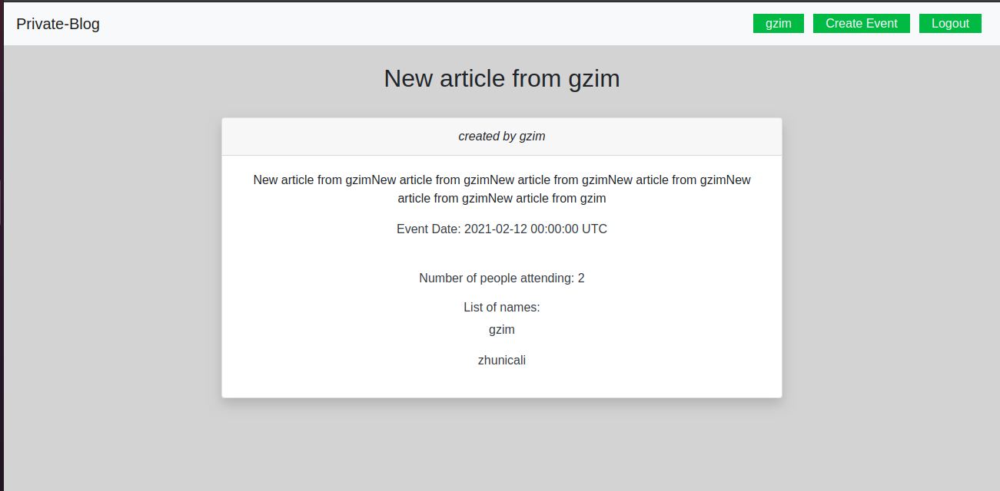

# private Events by Gzim Asani

> This project is part of Microverse Ruby on Rails project which allows users to create events and join other users events but it is required for the to first sign up and log in, in order to see the events and attend them





## Functionality

> In this project I created a simple app where users can create events and attend other users events

- This project was build using bootstrap and also customize css
- In this app it is required to sign up and log in, in order to attend and create events
- If the user tries to check the events without signing up the app will redirect him the the log in page
- Any user can create his own events and attend other events
- The user showpage displays users events that he has created, the users upcoming events and the previous events
- The events showpage displays all upcoming events highliting the creator and the date and also the opportunity to enroll to the event
- The events showpage also displays all previous events which have taken place in the past

## Built With

- Ruby on Rails
- Ruby
- Rubocop
- VS text editor
- Bootstrap
- Will paginate gem
- Rspec gem

## Getting started

> Before using the app make sure that you have have the necessary installation (GIT and Rails)

First clone the repo in your local machine:
```ruby
https://github.com/GzimAsani/Private-events.git
```
Second, install the required gems
```ruby
$ bundle install
```
Third, migrate database
```ruby
$ rails db:migrate
```
Lastly, on root path run a local server:
```ruby
$ rails server
```
Open browser to view application:
```ruby
localhost:3000
```

## Author

👤 **Gzim Asani**
- Github: [@GzimAsani](https://github.com/GzimAsani)
- Linkedin: [GzimAsani](https://www.linkedin.com/in/gzim-asani-83390a17a/)

## 🤝 Contributing

Contributions, issues and feature requests are welcome!

## Show your support

Give a ⭐️ if you like this project!

## Copyright
This is a project developed by Microverse Student as the part of skill curriculum.
